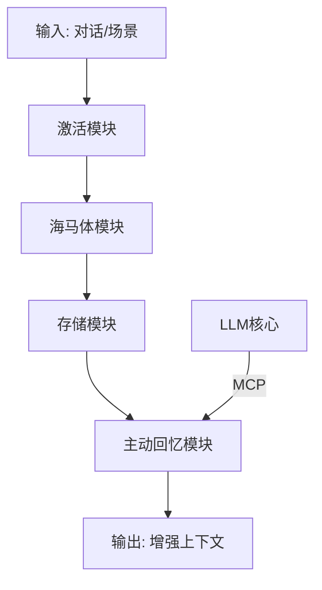

# Limbic Memory: 边缘海马忆存器

[](https://github.com/whatiname888/Limbic-Memory/blob/main/LICENSE)
[](https://github.com/whatiname888/Limbic-Memory/stargazers)

**Limbic Memory**（边缘海马忆存器）是一个开源参考架构项目，旨在为大型语言模型（LLM）提供生物启发的动态记忆增强方案。名字源于人类大脑的边缘系统（Limbic System），强调“边缘”外挂定位、“海马体”模拟短期到长期记忆转换，以及“忆存器”作为存储与管理机制的核心。项目解决LLM的上下文空间限制和“失忆”问题，通过模拟激活、忘记和时间顺序感，实现更智能的对话响应。

核心理念：LLM记忆不是静态全忆，而是动态激活、逐渐忘记、有时间顺序感，像人类大脑边缘系统。外挂设计，灵活适配各种模型（如GPT、Llama），实时响应（<1s），支持自定义深度/时长。

## 核心原则
- **生物启发**：模拟海马体转换、激活回忆、选择性忘记。
- **边缘定位**：外挂模块，不改LLM核心权重，提高架构灵活性。
- **主动性**：融入MCP（Model Context Protocol）协议，让LLM通过结构化指令主动控制回忆/存储/删除。
- **目标**：实时对话友好；开源参考，鼓励扩展到更复杂系统。

## 安装
（待实现：依赖Python 3.8+、Hugging Face Transformers、FAISS等。安装指南将在后续更新。）

```bash
# 示例：克隆仓库并安装依赖
git clone https://github.com/whatiname888/Limbic-Memory.git
cd Limbic-Memory
pip install -r requirements.txt
```

## 用法
（待实现：简单示例将在demo文件夹中提供。基本用法如导入模块并初始化忆存器。）

```python
# 示例伪代码
from limbic_memory import LimbicMemory

lm = LimbicMemory(model="gpt-3.5-turbo")
lm.activate("query text")
```

## 模块概述
项目模块松耦合，便于扩展：
- **激活模块**：输入激活相关记忆，添加概率阈值模拟不确定性。
- **记忆存储模块**：存储记忆，带时间/相关度衰减忘记机制。
- **海马体模块**：短期到长期转换，添加时间戳/顺序ID。
- **主动回忆模块**：解析MCP指令，实现LLM控制。
- **整体系统**：异步操作，确保兼容性和实时性。

（详细伪代码和实现将在后续文档或代码中补充。）

## 架构图


## 贡献
欢迎fork、PR或issue！这是一个“抛砖引玉”的项目，鼓励社区扩展（如加情感模块）。请阅读[CONTRIBUTING.md](CONTRIBUTING.md)。

## 许可证
本项目采用 [MIT License](LICENSE)。依赖开源项目（如Hugging Face），请遵守各自许可。

## 支持我们
如果这个项目对你有帮助，考虑[Buy Me a Coffee](https://www.buymeacoffee.com/your-username) 或 GitHub Sponsors 支持开发！你的捐赠将帮助我们迭代思路和demo。

感谢使用 Limbic Memory！

## 前端 UI 集成说明

本仓库集成了 NVIDIA 官方 NeMo Agent Toolkit UI 作为前端子模块，路径：`external/nemo-agent-toolkit-ui`。

### 拉取包含子模块的代码
```bash
git clone https://github.com/whatiname888/Limbic-Memory.git
cd Limbic-Memory
git submodule update --init --recursive
```

### 更新前端子模块到最新上游
```bash
cd external/nemo-agent-toolkit-ui
git fetch origin
git checkout origin/main
cd ../..
git add external/nemo-agent-toolkit-ui
git commit -m "chore: bump nemo-agent-toolkit-ui submodule"
```

### 安装并运行前端（示例）
```bash
cd external/nemo-agent-toolkit-ui
npm install  # 或使用 pnpm / yarn
npm run dev  # 默认 http://localhost:3000
```

### 说明
- 子模块不会自动包含依赖，请在首次拉取后自行执行安装命令。
- 该 UI 遵循其仓库的 Apache-2.0 许可证，相关 LICENSE 已保留。

