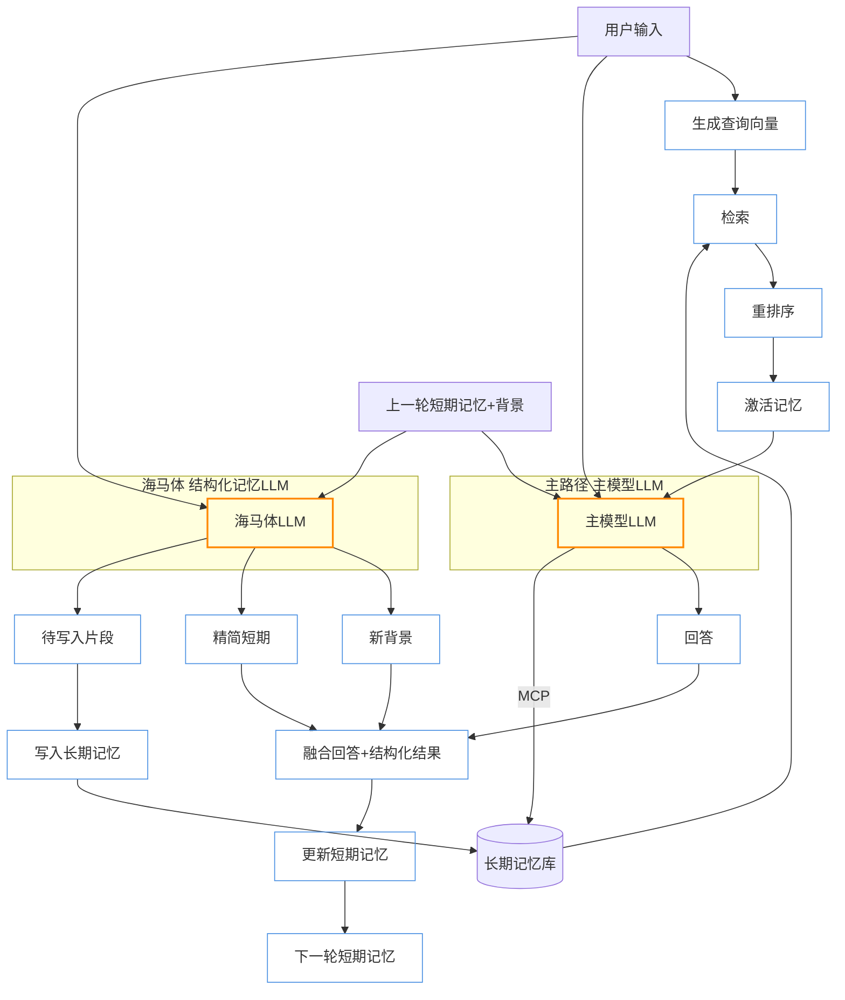

# Limbic Memory: 边缘海马忆存器

[](LICENSE)
[](https://github.com/whatiname888/Limbic-Memory/stargazers)

**Limbic Memory**（边缘海马忆存器）是一个开源参考架构项目，旨在为大型语言模型（LLM）提供生物启发的动态记忆增强方案。名字源于人类大脑的边缘系统（Limbic System），强调“边缘”外挂定位、“海马体”模拟短期到长期记忆转换，以及“忆存器”作为存储与管理机制的核心。项目解决 LLM 的上下文空间限制和“失忆”问题，通过模拟激活、忘记和时间顺序感，实现更智能的对话响应。

核心理念：LLM 记忆不是静态全忆，而是动态激活、逐渐忘记、具时间顺序感，像人类大脑边缘系统。外挂设计，灵活适配各种模型（GPT、Llama……），保持实时响应（<1s），支持自定义深度/时长。

## 核心原则
- **生物启发**：模拟海马体转换、激活回忆、选择性忘记。
- **边缘定位**：外挂模块，不改 LLM 核心权重，提高架构灵活性。
- **主动性**：融入 MCP（Model Context Protocol），让 LLM 主动控制回忆/存储/删除。
- **目标**：实时对话友好；作为开源参考，易于扩展。

## 安装
（待实现：依赖 Python 3.8+、Transformers、FAISS 等。正式实现后提供脚本与依赖说明。）

### 🆕 依赖安装脚本
`install.sh`：一键安装/更新 Python 与前端依赖；自动检测 requirements.txt / lock 文件是否变化；无需任何参数。

> 网络说明: 安装依赖需要访问 PyPI 与 npm registry。若网络不可用或被防火墙拦截，脚本可能表现为长时间无输出“卡住”。
>
> 诊断步骤：
> 1. 先测试网络: `curl -I https://pypi.org/simple` / `curl -I https://registry.npmmirror.com`。
> 2. 若确实离线，可使用离线模式：`LM_OFFLINE=1 ./install.sh`（将跳过依赖下载）。
> 3. 也可调整环境变量：`LM_PIP_TIMEOUT`、`LM_PIP_RETRIES`、`LM_NPM_MIRROR`。
> 4. 若曾部分下载，可删除 `.venv` 与前端 `node_modules` 后重试。


```bash
chmod +x install.sh
./install.sh   # 自动创建 .venv 并安装后端 + 前端依赖
# 若修改了 requirements.txt 或前端 package.json/lock 文件会自动重新安装
# 若要强制重装，删除对应 .deps.ok / .deps.hash 后再运行
```

## 模块概述
### 自动检索触发 (auto_query_recall)
为保证“根据用户问题自动激活相关记忆”的体验，新增配置开关与参数：
`memory.auto_query_recall` (bool) 是否开启自动召回
`memory.auto_query_recall_top_k` (int) 自动召回使用的 k（不影响模型自主记忆调用时的 top_k）
`memory.auto_query_recall_query_max_chars` (int) 从用户最近输入末尾截取的最大字符数作为查询

行为逻辑：
1. 每次进入对话回合，若模型自身在工具规划阶段未调用 `memory_recall` 且该开关为 true，则系统用“最近一条用户输入（截断到 max_chars）”作为查询自动触发一次召回。
2. 该自动召回会在工具步骤 Markdown 中展示（标注为一次正常的 recall 调用）。
3. 若仍无任何 `memory_store` 行为且用户句子包含长期偏好或目标关键词（喜欢/爱/目标/想要/想做/计划/习惯/偏好），系统会进行一次启发式存储，避免信息流失。

目的：防止提示词收紧后模型“过度保守”导致无回忆与空洞回答，保持连续性体验。

后续可扩展：
- 召回查询可改为对用户输入做抽象（去除寒暄、保留核心意图）。
- 支持多策略合并：语义+时间衰减+标签过滤。
- 引入 recall 负反馈：若多轮连续召回无结果，可动态降低频率。

- 激活模块：输入查询向量化 + 语义/标签多策略检索 + 排序。
- 记忆存储：时间/重要度衰减，层级结构预留。
- 海马体：短期窗口裁剪、摘要、巩固候选生成、短期→长期写入决策。
- 主动回忆（MCP）：memory.read / memory.write。
- 背景摘要：渐进式压缩被遗忘上下文，维持“语境惯性”。

---



**流程摘要**：主模型 LLM 与海马体 LLM 并行。海马体 LLM 直接一次性输出 3 个结构化部分：
1. 新背景（BgOut）：对“被移除或写入长期”的片段进行语义压缩的滚动摘要，保持语境惯性，不再保留细节。 
2. 精简短期（STMOut）：按“越靠前越压缩 / 越靠后越原始”原则生成的分层精简对话（压缩梯度在 prompt 中约束）。
3. 待写入片段（LTOut）：仅从本轮拟移除的短期内容中抽取的高价值记忆（条数不限，价值由提示词规则决定）。
程序解析结构化输出后：融合回答 + 新背景 + 精简短期生成新短期记忆（顶部放新背景），同时把待写入片段入长期记忆（可异步）。激活检索仅用当前输入触发，不阻塞主路径。

**模块职责拆分**
| 模块 | 作用 | 输入 | 输出 | 备注 |
|------|------|------|------|------|
| Activation | 从长期记忆取语义相关记忆 | 用户输入 | 激活记忆集合 | 仅本轮输入生成查询向量 |
| 主模型 LLM | 生成回答 | 用户输入, 上一轮短期记忆, 激活记忆 | 回复文本/流 | 可动态再取记忆(MCP) |
| MCP 工具层 | 记忆读/写/补检索 | 指令 | 记忆片段/写入确认 | 权限/访问控制 |
| 海马体 LLM | 结构化记忆输出 | 用户输入, 上一轮短期记忆 | 新背景, 精简短期, 待写入片段 | 压缩梯度 & 价值筛选由 prompt 约束 |
| 融合解析阶段 | 解析并融合结构化结果 | 回答, 新背景, 精简短期 | 新短期记忆 | 顶部插入新背景 |
| 长期记忆写入 | 永久化高价值记忆 | 待写入片段 | 向量+元数据记录 | 去重 & 可批量 |

**时间与并行性**
| 阶段 | 是否并行 | 说明 |
|------|----------|------|
| 激活检索 | 是 (轻量) | 与两个 LLM 启动基本同时 |
| 主模型回答 LLM | 是 (重) | 与海马体 LLM 并行 |
| 海马体 LLM | 是 (重) | 输出新背景/精简短期/待写入 |
| 融合解析 | 否 | 等待回答 + 结构化输出，轻量解析 |
| 写入长期 | 否 | 融合后；可延迟批处理 |

**关键策略亮点**
* 并行双 Heavy LLM：回答延迟≈max(主模型, 海马体)。
* 直接结构化输出：避免“计划再展开”额外步骤。
* 背景 = 移除内容的滚动语义压缩：保持情境连续性而非复述细节。
* 精简短期有压缩梯度：越靠时间早的内容压缩越强，近期保持更原始信息密度。
* 高价值记忆提取不设固定数量：价值标准由 prompt/策略调节。
* 上下文组装内联：无独立等待阶段。

**“背景”定义**：一种滚动语义摘要，仅覆盖已从短期记忆中剥离（被遗忘或写入长期）的片段；目的：保留语境惯性（人物/任务/长期目标）而非细节，可持续被新摘要覆盖（非累计增长）。
* MCP 让模型在生成中动态优化信息需求而非一次性注入全部上下文。
* 激活检索支持多因子排序：Score = α·语义 + β·时间衰减 + γ·重要性 + δ·近期引用。

**下一步可扩展**
* 分层记忆级：瞬时 / 工作记忆 / 情节记忆 / 语义记忆。
* 体验标签：情绪、用户偏好、目标状态。
* 强化学习自适应阈值：动态调整记忆写入策略。
* GPU/批量向量检索优化：合并多轮 embedding 查询。

## 贡献
欢迎fork、PR或issue！这是一个“抛砖引玉”的项目，鼓励社区扩展（如加情感模块）。请阅读[CONTRIBUTING.md](CONTRIBUTING.md)。

## 许可证
本项目采用 [MIT License](LICENSE)。依赖开源项目（如Hugging Face），请遵守各自许可。

## 支持我们
如果这个项目对你有帮助，考虑[Buy Me a Coffee](https://www.buymeacoffee.com/your-username) 或 GitHub Sponsors 支持开发！你的捐赠将帮助我们迭代思路和demo。

感谢使用 Limbic Memory！

## 前端 UI 集成说明

本仓库集成了 NVIDIA 官方 NeMo Agent Toolkit UI 作为前端子模块，路径：`external/nemo-agent-toolkit-ui`。

### 拉取包含子模块的代码
```bash
git clone https://github.com/whatiname888/Limbic-Memory.git
cd Limbic-Memory
git submodule update --init --recursive
```

### 更新前端子模块到最新上游
```bash
cd external/nemo-agent-toolkit-ui
git fetch origin
git checkout origin/main
cd ../..
git add external/nemo-agent-toolkit-ui
git commit -m "chore: bump nemo-agent-toolkit-ui submodule"
```

### 安装并运行前端（示例）
```bash
cd external/nemo-agent-toolkit-ui
npm install  # 或使用 pnpm / yarn
npm run dev  # 默认 http://localhost:3000
```

### 说明
- 子模块不会自动包含依赖，请在首次拉取后自行执行安装命令。
- 该 UI 遵循其仓库的 Apache-2.0 许可证，相关 LICENSE 已保留。

