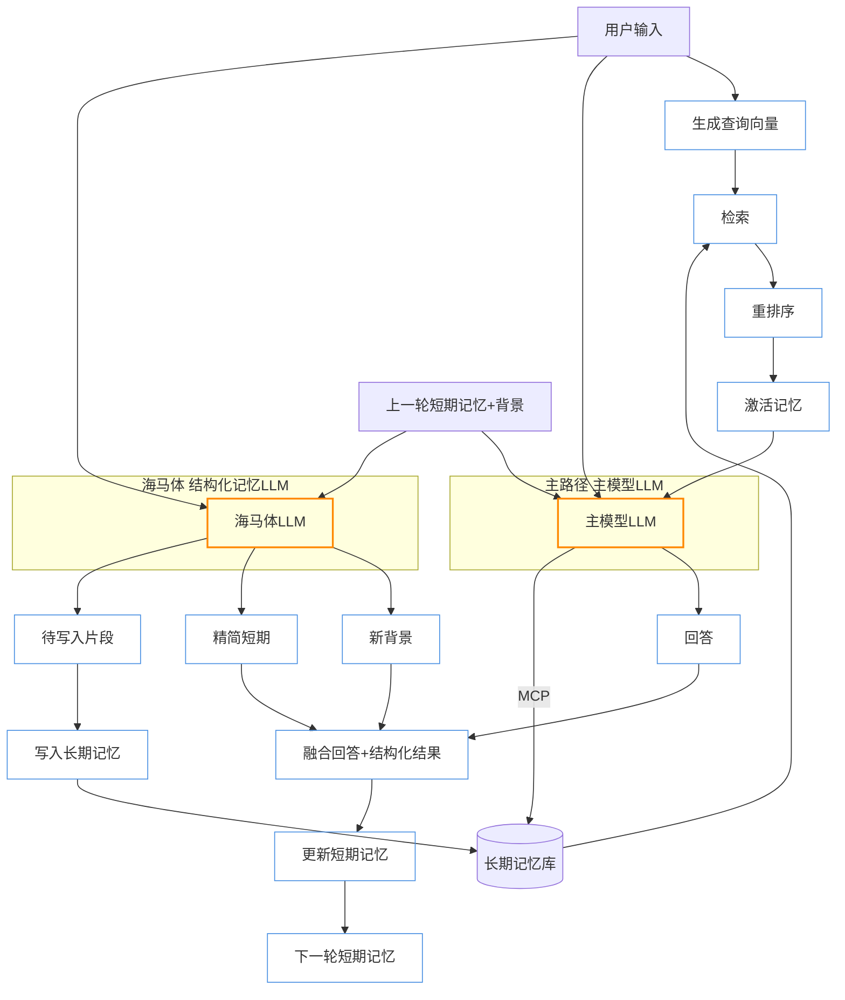

# Limbic Memory: 边缘海马忆存器

<p align="center">
  
</p>

[](LICENSE)
[](https://github.com/whatiname888/Limbic-Memory/stargazers)

**Limbic Memory**（边缘海马忆存器）是一个开源参考架构项目，旨在为大型语言模型（LLM）提供生物启发的动态记忆增强方案。名字源于人类大脑的边缘系统（Limbic System），强调“边缘”外挂定位、“海马体”模拟短期到长期记忆转换，以及“忆存器”作为存储与管理机制的核心。项目解决 LLM 的上下文空间限制和“失忆”问题，通过模拟激活、忘记实现更智能的对话响应。

核心理念：LLM 记忆不是静态全忆，而是动态激活、逐渐忘记、具时间顺序感，像人类大脑边缘系统。外挂设计，灵活适配各种模型（GPT、Llama……），保持实时响应（<1s），支持自定义深度/时长。

## 核心原则
- **生物启发**：模拟海马体转换、激活回忆、选择性忘记。
- **边缘定位**：外挂模块，不改 LLM 核心权重，提高架构灵活性。
- **主动性**：融入 MCP（Model Context Protocol），让 LLM 主动控制回忆/存储/删除。
- **目标**：实时对话友好；作为开源参考，易于扩展。

## 安装 & 启动 (推荐快速路径)

### 0. 拉取仓库（含子模块 UI）
```bash
git clone https://github.com/whatiname888/Limbic-Memory.git
cd Limbic-Memory
git submodule update --init --recursive
```

### 1. 安装依赖
```bash
chmod +x install.sh start.sh
./install.sh   # 创建/复用 .venv 并安装后端 + 前端依赖，自动生成 backend/config.json(若不存在)
```

### 2. 配置后端密钥
编辑 `backend/config.json`（由 install.sh 复制自 `config.example.json`）：
```jsonc
{
    "chat": { "api_key": "YOUR_KEY", "base_url": "https://dashscope.aliyuncs.com/compatible-mode/v1", "model": "qwen3-max-preview" },
    "embedding": { "api_key": "YOUR_KEY", "base_url": "https://dashscope.aliyuncs.com/compatible-mode/v1", "model": "text-embedding-v1" },
    "hippocampus": { "api_key": "YOUR_KEY", "base_url": "https://dashscope.aliyuncs.com/compatible-mode/v1", "model": "qwen3-max-preview", "inject_context": true }
}
```
说明：兼容 OpenAI 协议，替换成自建或其它代理 → 调整 `base_url` 与模型名即可。

### 3. 启动（快速）
```bash
./start.sh            # 同时拉起后端(默认 8000) + 前端(自动找 3000+ 空闲端口)
```
浏览器访问：
```
http://localhost:3000    (若被占用，脚本会顺延端口；终端日志显示实际端口)
```
后台模式：
```bash
./start.sh -d          # DETACH，不阻塞当前终端
```
常用环境变量：
```bash
LM_BACKEND_PORT=8100 ./start.sh   # 指定后端端口
LM_KILL_8000=1 ./start.sh         # 若 8000 被占用，尝试自动杀掉占用进程
LM_SKIP_HEALTH=1 ./start.sh       # 跳过 /healthz 自检
```

健康检查：脚本自动轮询 `http://127.0.0.1:8000/healthz`（或你的自定义端口）。

> 到此为止：克隆 → install.sh → 编辑 config.json → start.sh 即可完成最小可用启动。

---

## 进阶 / 手动调试启动方式

以下仅在需要分别调试或二次开发时使用。

### A. 仅启动后端（FastAPI）
```bash
source .venv/bin/activate
uvicorn backend.main:app --reload --port 8000
```

### B. 仅启动前端（Next.js UI）
```bash
cd external/nemo-agent-toolkit-ui
npm run dev
```
前端依赖 `.env.local`（由 `start.sh` 自动生成）。若单独启动需手动创建：
```bash
cat > .env.local <<EOF
NEXT_PUBLIC_WEBSOCKET_CHAT_COMPLETION_URL=ws://127.0.0.1:8000/websocket
NEXT_PUBLIC_HTTP_CHAT_COMPLETION_URL=http://127.0.0.1:8000/chat/stream
NEXT_PUBLIC_WEB_SOCKET_DEFAULT_ON=false
NEXT_PUBLIC_CHAT_HISTORY_DEFAULT_ON=false
NEXT_PUBLIC_RIGHT_MENU_OPEN=false
EOF
```

### C. 常见问题速查
| 场景 | 处理 |
|------|------|
| 启动提示端口被占用 | `LM_KILL_8000=1 ./start.sh` 或改端口 `LM_BACKEND_PORT=8101` |
| 首次没生成 config.json | 再跑一次 `./install.sh` 或手动复制 example |
| 模型 401/鉴权失败 | 确认 `backend/config.json` 中 `api_key` 正确且未包含隐藏空格 |
| 前端接口 404 | 检查后端是否健康：`curl -i http://127.0.0.1:8000/healthz` |
| 需要离线调试 | 先在线安装依赖后缓存，再用 `LM_OFFLINE=1 ./start.sh` |

---

## 说明补充
* 使用 *OpenAI Python SDK* 兼容模式；任意兼容 Chat/Embedding 协议服务都可接入。
* `start.sh` 若检测依赖缺失会自动调用 `install.sh`（可关闭网络后本地复用缓存）。
* 日志输出目录：`.runtime/`，包含 `backend.log` / `frontend.log`。
* 终止：前台模式 Ctrl+C；后台模式手动 `kill <PID>`。

---



**流程摘要**：主模型 LLM 与海马体 LLM 并行。海马体 LLM 直接一次性输出 3 个结构化部分：
1. 新背景（BgOut）：对“被移除或写入长期”的片段进行语义压缩的滚动摘要，保持语境惯性，不再保留细节。 
2. 精简短期（STMOut）：按“越靠前越压缩 / 越靠后越原始”原则生成的分层精简对话（压缩梯度在 prompt 中约束）。
3. 待写入片段（LTOut）：仅从本轮拟移除的短期内容中抽取的高价值记忆（条数不限，价值由提示词规则决定）。
程序解析结构化输出后：融合回答 + 新背景 + 精简短期生成新短期记忆（顶部放新背景），同时把待写入片段入长期记忆（可异步）。激活检索仅用当前输入触发，不阻塞主路径。

**模块职责拆分**
| 模块 | 作用 | 输入 | 输出 | 备注 |
|------|------|------|------|------|
| Activation | 从长期记忆取语义相关记忆 | 用户输入 | 激活记忆集合 | 仅本轮输入生成查询向量 |
| 主模型 LLM | 生成回答 | 用户输入, 上一轮短期记忆, 激活记忆 | 回复文本/流 | 可动态再取记忆(MCP) |
| MCP 工具层 | 记忆读/写/补检索 | 指令 | 记忆片段/写入确认 | 权限/访问控制 |
| 海马体 LLM | 结构化记忆输出 | 用户输入, 上一轮短期记忆 | 新背景, 精简短期, 待写入片段 | 压缩梯度 & 价值筛选由 prompt 约束 |
| 融合解析阶段 | 解析并融合结构化结果 | 回答, 新背景, 精简短期 | 新短期记忆 | 顶部插入新背景 |
| 长期记忆写入 | 永久化高价值记忆 | 待写入片段 | 向量+元数据记录 | 去重 & 可批量 |

**时间与并行性**
| 阶段 | 是否并行 | 说明 |
|------|----------|------|
| 激活检索 | 是 (轻量) | 与两个 LLM 启动基本同时 |
| 主模型回答 LLM | 是 (重) | 与海马体 LLM 并行 |
| 海马体 LLM | 是 (重) | 输出新背景/精简短期/待写入 |
| 融合解析 | 否 | 等待回答 + 结构化输出，轻量解析 |
| 写入长期 | 否 | 融合后；可延迟批处理 |

**关键策略亮点**
* 并行双 Heavy LLM：回答延迟≈max(主模型, 海马体)。
* 直接结构化输出：避免“计划再展开”额外步骤。
* 背景 = 移除内容的滚动语义压缩：保持情境连续性而非复述细节。
* 精简短期有压缩梯度：越靠时间早的内容压缩越强，近期保持更原始信息密度。
* 高价值记忆提取不设固定数量：价值标准由 prompt/策略调节。
* 上下文组装内联：无独立等待阶段。

**“背景”定义**：一种滚动语义摘要，仅覆盖已从短期记忆中剥离（被遗忘或写入长期）的片段；目的：保留语境惯性（人物/任务/长期目标）而非细节，可持续被新摘要覆盖（非累计增长）。
* MCP 让模型在生成中动态优化信息需求而非一次性注入全部上下文。

**下一步可扩展**
* 分层记忆级：瞬时 / 工作记忆 / 情节记忆 / 语义记忆。
* 体验标签：情绪、用户偏好、目标状态。
* 强化学习自适应阈值：动态调整记忆写入策略。
* GPU/批量向量检索优化：合并多轮 embedding 查询。

## 贡献
本项目最初作为一次 Hackathon 的实验性成果，定位是“抛砖引玉” —— 鼓励社区去进一步探索大模型的“外围神经系统”：即不直接改动参数权重，而是在模型上下文与工具调用边缘，通过类海马体（Hippocampus）的结构化记忆整合、长短期分层、情境滚动摘要与价值记忆提炼，让模型更具“人味”的连续感与自洽人格。

我们当前实现的是一个极简原型：
* 并行海马体 LLM 结构化输出 + 主回应流合并的记忆拟生机制；
* 原始对话全量保持 + 语义背景滚动压缩的双轨；
* MCP/工具化记忆读写（memory_recall / memory_store）让模型显式“申请”信息；
* 为后续“随推理微演化”预留接口（可插入策略：价值强化 / 情绪标签 / 偏好曲线）。

愿景：未来看到“海马体 / 记忆整合层”原生成为主流 LLM 系统结构的一层基础设施，而不是外挂补丁——补齐当下对话式 AI 在时间连续性、身份稳定性与长期承载“生活纹理”上的缺憾。

你可以贡献的方向：
1. 记忆价值判定策略（打分/强化学习/稀疏触发）。
2. 多模态线索（图像/语音事件）进入同一记忆管线。
3. 人格/情绪基调缓慢漂移模型（时间加权或节律曲线）。
4. 记忆冲突检测与自我修正（反事实比对 / 版本链）。
5. 更安全的“遗忘”策略（合规清除 / 加密拆分保存）。

欢迎提交 PR / Issue / 讨论帖。如果你在实现一条“外围神经”新路径（例如：梦境回放、睡眠批处理、情绪稳态调节），非常期待链接你的实验。让我们一起把“人格化 + 持久记忆 + 自进化”从畅想推进为基础组件。 🤝

## 许可证
本项目采用 [MIT License](LICENSE)。依赖开源项目，请遵守各自许可。

感谢使用 Limbic Memory！

## 前端 UI 集成说明

本仓库集成了 NVIDIA 官方 NeMo Agent Toolkit UI 作为前端子模块，路径：`external/nemo-agent-toolkit-ui`。

### 拉取包含子模块的代码
```bash
git clone https://github.com/whatiname888/Limbic-Memory.git
cd Limbic-Memory
git submodule update --init --recursive
```

### 说明
- 子模块不会自动包含依赖，请在首次拉取后自行执行安装命令。
- 该 UI 遵循其仓库的 Apache-2.0 许可证，相关 LICENSE 已保留。

