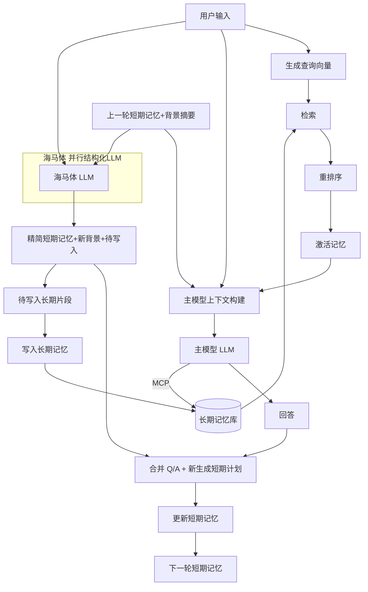

# Limbic Memory: 边缘海马忆存器

[](LICENSE)
[](https://github.com/whatiname888/Limbic-Memory/stargazers)

**Limbic Memory**（边缘海马忆存器）是一个开源参考架构项目，旨在为大型语言模型（LLM）提供生物启发的动态记忆增强方案。名字源于人类大脑的边缘系统（Limbic System），强调“边缘”外挂定位、“海马体”模拟短期到长期记忆转换，以及“忆存器”作为存储与管理机制的核心。项目解决 LLM 的上下文空间限制和“失忆”问题，通过模拟激活、忘记和时间顺序感，实现更智能的对话响应。

核心理念：LLM 记忆不是静态全忆，而是动态激活、逐渐忘记、具时间顺序感，像人类大脑边缘系统。外挂设计，灵活适配各种模型（GPT、Llama……），保持实时响应（<1s），支持自定义深度/时长。

## 核心原则
- **生物启发**：模拟海马体转换、激活回忆、选择性忘记。
- **边缘定位**：外挂模块，不改 LLM 核心权重，提高架构灵活性。
- **主动性**：融入 MCP（Model Context Protocol），让 LLM 主动控制回忆/存储/删除。
- **目标**：实时对话友好；作为开源参考，易于扩展。

## 安装
（待实现：依赖 Python 3.8+、Transformers、FAISS 等。正式实现后提供脚本与依赖说明。）

### 🆕 环境快速初始化脚本
`start.sh`：自动检测环境、创建/复用 `.venv`，如存在 `requirements.txt` 则安装；若不存在仅创建虚拟环境。

```bash
chmod +x start.sh
./start.sh          # 默认初始化
./start.sh --reinstall   # 你后续新增/修改了 requirements.txt 后重装
```

## 用法（占位）
后续将补充：
```python
from limbic_memory import LimbicMemory
lm = LimbicMemory(model="gpt-3.5-turbo")
lm.activate("query text")
```

## 模块概述（规划）
- 激活模块：输入查询向量化 + 语义/标签多策略检索 + 排序。
- 记忆存储：时间/重要度衰减，层级结构预留。
- 海马体：短期窗口裁剪、摘要、巩固候选生成、短期→长期写入决策。
- 主动回忆（MCP）：memory.read / memory.write / recall / expand。
- 背景摘要：渐进式压缩被遗忘上下文，维持“语境惯性”。
- 巩固策略：重要性 / 新颖性 / 引用频次 / 情境触发融合打分。

---

## 架构（最新版记忆流程）



**流程摘要**：输入后并行启动两个较重 LLM：主模型直接生成回答；海马体 LLM 根据“用户输入 + 上一轮短期记忆（含旧背景摘要）”生成统一的记忆计划：包含(1) 精简后的新短期记忆候选；(2) 新背景摘要（对将被移除或转长期的片段压缩）；(3) 待写入长期的片段列表。合并阶段只负责把回答与记忆计划融合并形成新短期记忆（其顶部直接放入海马体 LLM 产出的新背景摘要），无需再计算摘要，保证全程并行。查询向量只由本轮输入生成，避免冗余。

**模块职责拆分**
| 模块 | 作用 | 输入 | 输出 | 备注 |
|------|------|------|------|------|
| Activation | 从长期记忆取语义相关记忆 | 用户输入 | 激活记忆集合 | 仅本轮输入生成查询向量 |
| 主模型上下文构建 | 准备主模型上下文 | 用户输入, 上一轮短期记忆, 激活记忆 | Prompt上下文 | 上一轮短期记忆顶部已含旧背景摘要 |
| 主模型 LLM | 生成回答 | 上下文 | 回复文本/流 | 可动态再取记忆 (MCP) |
| MCP 工具层 | 记忆读/写/补检索 | 指令 | 记忆片段/写入确认 | 权限/访问控制 |
| 海马体 LLM | 结构化记忆计划 | 用户输入, 上一轮短期记忆 | 记忆计划(精简短期+新背景+待写入) | 并行输出新背景摘要 |
| 合并阶段 | 融合回答与记忆计划 | 回答, 记忆计划 | 新短期记忆 | 直接采用计划中的新背景摘要 |
| 长期记忆写入 | 永久化高价值记忆 | 待写入片段 | 向量+元数据记录 | 去重 & 可批量 |

**时间与并行性**
| 阶段 | 是否并行 | 说明 |
|------|----------|------|
| 激活检索 | 是 (轻量) | 与两个 LLM 启动基本同时 |
| 主模型回答 LLM | 是 (重) | 与海马体 LLM 并行 |
| 海马体 LLM | 是 (重) | 输出完整记忆计划 (含新背景) |
| 合并更新 | 否 | 等待回答 + 记忆计划；直接采用新背景 |
| 写入长期 | 否 | 合并后；写入可延迟批处理 |

**关键策略亮点**
* 双重 LLM 并行：主模型回答与海马体统一记忆计划（含新背景）生成同时完成。
* 一体化记忆计划：海马体直接给出精简短期 + 新背景 + 待写入，合并阶段零摘要计算。
* 新背景摘要即时可用：主模型不被阻塞；缩短总交互延迟。
* MCP 让模型在生成中动态优化信息需求而非一次性注入全部上下文。
* 激活检索支持多因子排序：Score = α·语义 + β·时间衰减 + γ·重要性 + δ·近期引用。

**下一步可扩展**
* 分层记忆级：瞬时 / 工作记忆 / 情节记忆 / 语义记忆。
* 体验标签：情绪、用户偏好、目标状态。
* 强化学习自适应阈值：动态调整记忆写入策略。
* GPU/批量向量检索优化：合并多轮 embedding 查询。

## 贡献
欢迎fork、PR或issue！这是一个“抛砖引玉”的项目，鼓励社区扩展（如加情感模块）。请阅读[CONTRIBUTING.md](CONTRIBUTING.md)。

## 许可证
本项目采用 [MIT License](LICENSE)。依赖开源项目（如Hugging Face），请遵守各自许可。

## 支持我们
如果这个项目对你有帮助，考虑[Buy Me a Coffee](https://www.buymeacoffee.com/your-username) 或 GitHub Sponsors 支持开发！你的捐赠将帮助我们迭代思路和demo。

感谢使用 Limbic Memory！

## 前端 UI 集成说明

本仓库集成了 NVIDIA 官方 NeMo Agent Toolkit UI 作为前端子模块，路径：`external/nemo-agent-toolkit-ui`。

### 拉取包含子模块的代码
```bash
git clone https://github.com/whatiname888/Limbic-Memory.git
cd Limbic-Memory
git submodule update --init --recursive
```

### 更新前端子模块到最新上游
```bash
cd external/nemo-agent-toolkit-ui
git fetch origin
git checkout origin/main
cd ../..
git add external/nemo-agent-toolkit-ui
git commit -m "chore: bump nemo-agent-toolkit-ui submodule"
```

### 安装并运行前端（示例）
```bash
cd external/nemo-agent-toolkit-ui
npm install  # 或使用 pnpm / yarn
npm run dev  # 默认 http://localhost:3000
```

### 说明
- 子模块不会自动包含依赖，请在首次拉取后自行执行安装命令。
- 该 UI 遵循其仓库的 Apache-2.0 许可证，相关 LICENSE 已保留。

